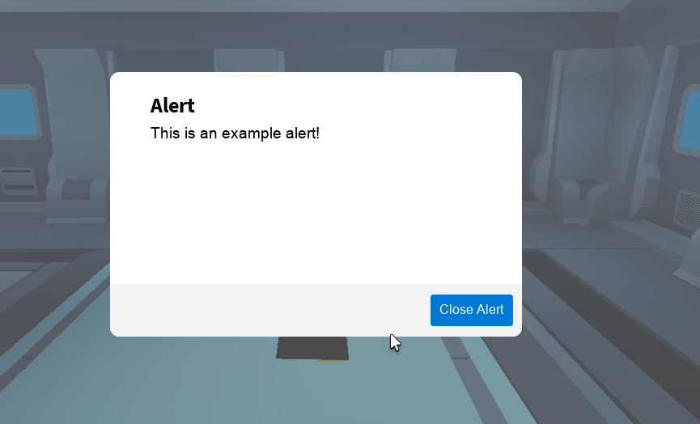
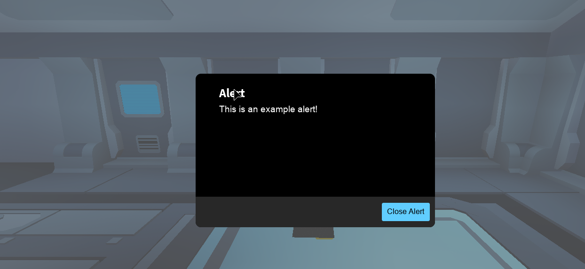

import Tabs from "@theme/Tabs";
import TabItem from "@theme/TabItem";

# Alert

:::note
This module can be used both server-side and client-sided. For client side, you should import the [AlertLibrary](http://localhost:3000/BetterUI/api/AlertLibrary) directly.
:::

:::success example
```lua
--- Script (Recommended)
local players = game:GetService"Players"
local playerToSend = players.TestPlayer
local _L = require(path.to.BetterUI)
_L.Alert:new(playerToSend, "Alert", "Example description", "Close Alert", true)
```
<strong>Result</strong>:

<Tabs>
<TabItem value="lt" label="Light Theme">



</TabItem>
<TabItem value="dt" label="Dark Theme">



</TabItem>
</Tabs>
:::