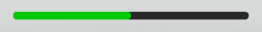

# Progress Bar

:::info
You must use `:setParent` before it getting into a parent
:::

:::success Example

```lua
-- LocalScript (Recommended)
local player = game:GetService"Players".LocalPlayer
local _L = require(path.to.BetterUI.Library.Progress) -- Replace with the BetterUI Interface you placed into! ReplicatedStorage is recommended.
local gs = player.PlayerGui.gameGui -- what your gui named (Gui Instance is required for it to work!!!)

local g = _L.new()
g:setParent(gs) -- replace with the parent you want to set!!
g:setPosition(UDim2.new(0.5, 0, 0.5, 0))
g:setAnchorPoint(Vector2.new(0.5, 0.5))
g:setSize(UDim2.new(0, 300, 0, 10)) -- Replace with scale if you want.
g:setPgColor(Color3.fromRGB(0, 200, 0))
g:setBackground(Color3.fromRGB(40, 40, 40))
g:setCorner(UDim.new(0, 2048))
```

<strong>Result</strong>:


:::